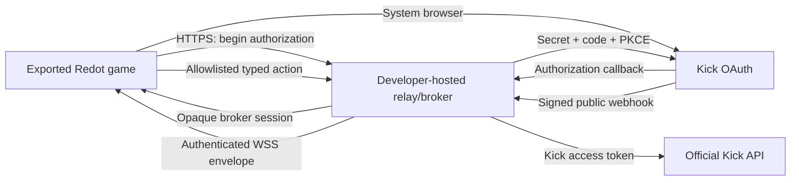

# redot-kicker relay and confidential-client architecture

**Decision:** accepted 2026-08-11
**Protocol version:** 1
**Topology:** self-hosted, single-tenant relay/broker per integrating developer

## Boundary

Every game developer or publisher registers and owns one Kick application and deploys one relay for that application. The relay is the OAuth confidential client, official webhook receiver, subscription controller, Kick API proxy, and authenticated event downlink. It is not embedded in the Redot addon and it is not a shared managed service.

The Redot client never receives a Kick client secret, access token, or refresh token. It receives one opaque broker-session credential bound to the developer application, authorized Kick user/channel, and stable local session slot. Windows Credential Manager or Linux Secret Service stores that credential. A versioned descriptor under `user://redot-kicker/sessions/` contains only non-secret identifiers and expiry metadata.

## Authorization and persistence flow

1. The game creates a high-entropy one-time client proof and asks its configured relay to begin authorization for a minimum capability-derived scope set.
2. The relay creates and retains the OAuth state and PKCE verifier, returns a public authorization URL plus an opaque request ID, and stores only a hash of the desktop proof.
3. The plugin opens the system browser. Kick redirects to the relay's registered HTTPS callback.
4. The relay validates state, exchanges the code with its client secret and PKCE verifier, resolves the authorized identity/channel, and stores the Kick tokens in its protected vault.
5. The game presents its one-time proof while polling or waiting for completion. The relay returns a single-use opaque broker-session credential and a non-secret session descriptor.
6. The plugin stores the credential in the desktop OS vault and the descriptor under `user://`. On restart it reads both and calls the relay's restore endpoint.
7. The relay rotates the broker session independently of the Kick token lifecycle. A stolen broker session is scoped and revocable; it is not a Kick token.
8. Disconnect deletes local memory and stops transports. Clear-data also deletes the descriptor and OS-vault record. Revoke invalidates the broker session and instructs the relay to revoke and delete associated Kick tokens.

The slot is a local vault/descriptor key, not a relay-wide identity or authority. Each successful OAuth callback creates an independent broker session, even when another account or installation uses the same slot name. Restore, rotation, and revocation require that session's opaque broker credential. A later login cannot prove it owns another installation's session from the slot alone, so it does not replace or revoke that session. If a local reauthorization overwrites its saved credential, the older relay session remains until its broker expiry or explicit credential-based revocation; operators should account for that retention.

## Webhook ingress

The relay uses the current official Kick verification string exactly:

`Kick-Event-Message-Id + "." + Kick-Event-Message-Timestamp + "." + raw request body`

Processing order is fixed:

1. Enforce method, content type, raw-body size, and required-header length bounds.
2. Resolve the subscription to the one local application/channel binding.
3. Validate RFC3339 timestamp freshness.
4. SHA-256 hash the exact signed bytes and verify the Base64 RSA PKCS#1 v1.5 signature with Kick's current public key.
5. Reject replayed message identity inside a bounded TTL cache.
6. Parse JSON only after steps 1-5 pass.
7. Compare the payload broadcaster with the authorized channel.
8. Transform into `relay_downlink.schema.json`, enqueue within a fixed bound, and discard the raw body.

Replay protection fails closed when its bounded cache is full; it never evicts an unexpired identity merely to admit a newer event. The relay enters an explicit degraded state so an attacker cannot force a still-fresh signed replay to be accepted through capacity pressure.

The game-side downlink has a separate rolling dedupe cache (5,000 IDs, one-hour TTL). It evicts the oldest ID at capacity instead of refusing all later chat. This does not change the signed webhook replay rule above: after more than 5,000 distinct delivered IDs in an hour, a very old downlink duplicate may reach game logic again. The game receives/pumps at most 64 packets/events per frame by default and queues at most 256 envelopes. Its WebSocket packet buffer is capped at 1,024 packets, with each packet bounded by `max_packet_bytes`. On game queue overflow it drops the newest excess event, emits `queue_pressure`, enters degraded state, and does not remember the dropped ID, so a later relay retry can be accepted. WebSocket-level buffer exhaustion may close the connection; the relay does not promise retry of a dropped downlink event. Consumers requiring durable exactly-once processing need their own application-level persistence.

Unknown authenticated event types or versions are delivered through a typed `unknown_event` path without disconnecting the session. They are never guessed into a known model.

## Data lifecycle

| Datum | Location | Persistence |
| --- | --- | --- |
| Kick client secret | Relay protected configuration/vault | Until operator rotates/deletes application configuration |
| Kick access/refresh tokens | Relay protected vault | Until revoke, authorization loss, clear-data completion, or operator deletion |
| Broker-session credential | Desktop OS vault and relay hashed/session state | Until expiry, rotation, revoke, or clear-data |
| Non-secret session descriptor | Desktop `user://` | Until disconnect policy or clear-data |
| Raw webhook body | Relay memory | Only through verification, transform, and dispatch |
| Replay/deduplication identity | Relay/client bounded memory | Fixed TTL/capacity only |
| Write idempotency record | Relay encrypted state | Hashed key, request hash, sanitized response, fixed 24-hour TTL/capacity |
| Ordinary diagnostics | Relay/client structured logs | Redacted; no body, token, signature, code, or credential |

The integrating developer is the relay operator and data controller. Before live users, they must publish retention/deletion contacts, choose a host and monitoring backend, configure TLS and backups for vault state, and define incident response. The plugin cannot make those deployment-specific promises on their behalf.

## Degraded modes

- No relay configuration: disconnected with a typed setup requirement.
- Authorized broker but event downlink unavailable: `REST_ONLY`; typed actions may continue if the broker is healthy.
- Queue pressure or dropped delivery: explicit degraded state; no silent oldest/newest drop.
- Subscription removal or webhook health failure: explicit subscription degradation and reconciliation request.
- Broker session expiry: stop privileged work and request restore/rotation or reauthorization.
- WSS connection: first exchange the broker session over HTTPS for a single-use, short-lived downlink ticket. Never put the broker credential in a URL or WebSocket subprotocol.
- Relay unreachable during clear-data: delete local state immediately, report remote revocation pending, and never restore automatically from plaintext.

## Runtime decision and remaining external gates

The reference relay is TypeScript on Node.js 24 LTS and ships as a hardened `linux/amd64` Docker image. The repository intentionally does not select the integrating developer's hosting vendor, TLS terminator, secret manager, monitoring backend, cost owner, privacy policy, or support contact. Live certification additionally requires a developer-owned Kick application, test channels/accounts, a public staging relay, and observation of current rate/subscription limits.
